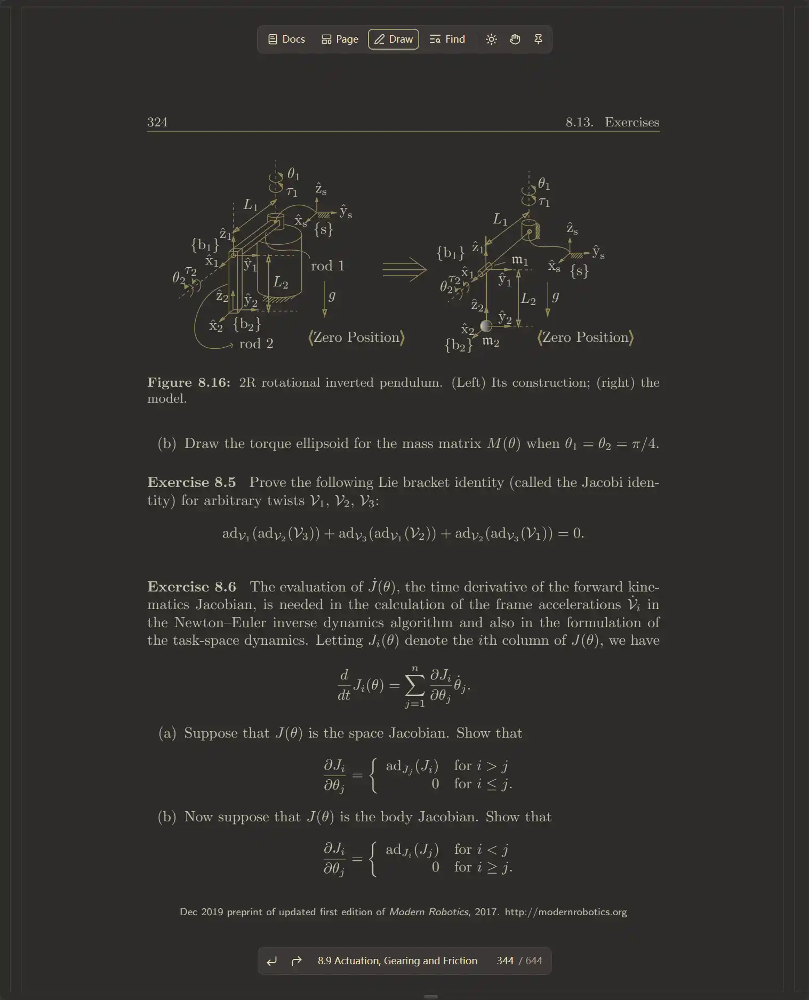
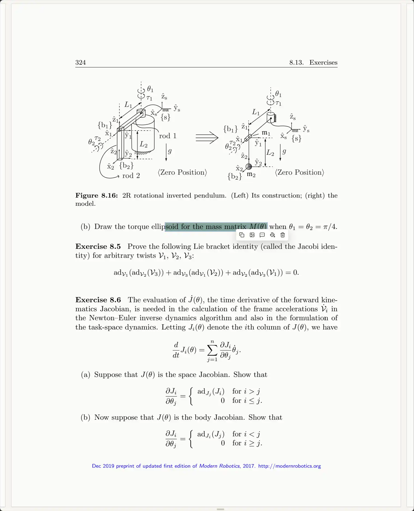

# PDF.ts

A polished PDF viewer powered by EmbedPDF, available for the web, Chrome,
Linux, Windows, and macOS.

The browser build targets ES2025 and requires Chrome/Edge 129+, Firefox 147+,
or Safari 26+.

Translation is local-only and requires browser support for the built-in
Translator API; Microsoft Edge 148 or later is required. The target language
defaults to the browser's preferred language and can be changed in the
Developer dialog. Translation uses [BCP 47](https://www.rfc-editor.org/info/bcp47)
tags: `zh-Hans` for Simplified Chinese and `zh-Hant` for Traditional Chinese.
Consult the [official Edge language list](https://github.com/MicrosoftEdge/Demos/blob/main/built-in-ai/static/translator-api.js)
or use the [Edge Built-in AI Playground](https://microsoftedge.github.io/Demos/built-in-ai/)
to check model availability.

## Build

All builds require Node.js with Corepack/pnpm. Native packaging additionally
requires:

- Go 1.23+ to build the launcher
- [nFPM](https://nfpm.goreleaser.com/docs/install/) to create `deb`/`rpm` packages
- NSIS and a PE resource compiler to create the Windows installer on Linux
- macOS system tools `hdiutil`, `sips`, `iconutil`, and `ditto` to create
  unsigned app bundles and disk images

```bash
corepack enable
pnpm install

# Debian / Ubuntu
sudo apt install golang-go binutils-mingw-w64-x86-64 nsis

# Fedora
sudo dnf install golang mingw64-binutils mingw32-nsis

# Install nFPM; ensure $(go env GOPATH)/bin is in PATH
go install github.com/goreleaser/nfpm/v2/cmd/nfpm@latest
```

macOS launchers, app bundles, and DMGs must be built on macOS. The required
packaging commands are provided by the operating system, so no third-party DMG
dependency is needed. The macOS artifacts are intentionally neither signed nor
notarized, and the packaging process does not invoke `codesign`. Set
`PDF_TS_HDIUTIL` only when `hdiutil` is installed outside its normal system
location. Go may add the minimal ad-hoc code-signature structure required for
an Apple Silicon executable; this does not identify the developer or make the
app trusted by Gatekeeper.

The Fedora `mingw32-nsis` package is intentional: NSIS uses its traditional
x86 bootstrap to install the 64-bit `pdf.ts.exe` into `%ProgramFiles%`.
Custom tool locations can be supplied through `PDF_TS_GO`, `PDF_TS_WINDRES`,
`PDF_TS_MAKENSIS`, `PDF_TS_NFPM`, and `PDF_TS_HDIUTIL`.

Compile the shared browser viewer once:

```bash
pnpm compile
```

The static web app is written to `release/web`. Package any host from that
compiled viewer without rebuilding the frontend:

```bash
pnpm package:chrome
pnpm package:windows # Windows binary and NSIS installer
pnpm package:linux   # Linux binary, deb, and Fedora-compatible rpm
pnpm package:macos   # unsigned amd64 and arm64 macOS apps and DMGs
pnpm package:deb     # Linux binary and deb only
pnpm package:rpm     # Linux binary and rpm only
```

See [`packaging/README.md`](packaging/README.md).

To compile once and package every host:

```bash
pnpm build:all
```

Artifacts are written to:

- `release/pdf-ts-chrome-v<version>.zip`
- `release/pdf.ts`
- `release/pdf.ts.exe`
- `release/pdf-ts_<version>_amd64.deb`
- `release/pdf-ts-<version>-1.x86_64.rpm`
- `release/pdf-ts-setup-v<version>.exe`
- `release/macos-<arch>/pdf.ts.app`
- `release/pdf-ts-v<version>-macos-<arch>.dmg`

The desktop launcher serves the viewer from `pdf.ts.localhost` and safely saves
full or incremental updates. Portable launchers expose `pdf.ts purge` to stop
the current user's daemon and delete that user's viewer data. Installation,
uninstallation, and PDF file association are owned by nFPM, NSIS, or the macOS
app bundle instead of launcher commands.
Launching `pdf.ts` without arguments opens the shared Welcome screen; selecting
or dropping a PDF there uses the browser's local-file saving capabilities.

<table>
  <tr>
    <td align="center">
      
      <br />
      Gruvbox
    </td>
    <td align="center">
      
      <br />
      Light
    </td>
  </tr>
</table>
