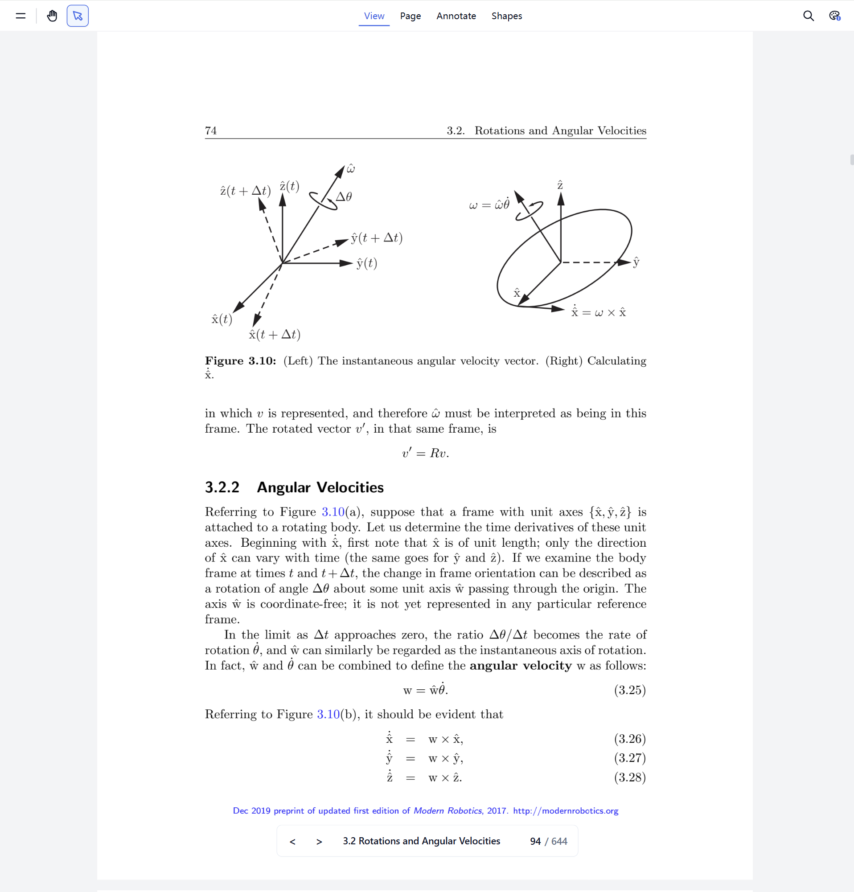

# pdf.ts Extension

A polished PDF viewer powered by EmbedPDF, available for the web, VS Code, and Chrome.

## Desktop launcher

The launcher is built into this repository and only accepts PDF files. It
serves the viewer from `pdf.ts.localhost`, safely saves full or incremental
updates, and installs only the PDF file association.

```bash
pnpm build:linux
pnpm build:windows
```

Artifacts are written to `release/launcher/pdf.ts` and
`release/launcher/pdf.ts.exe`.

## Build

```bash
# Static web app (output: release/web)
pnpm build:web

# Chrome extension
pnpm build:chrome

# VS Code extension
pnpm build:vscode
```


