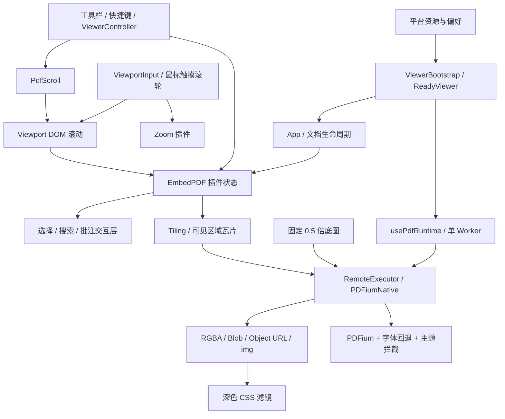

# 渲染与交互设计审查

审查日期：2026-09-08。下文保留改动前的审查结论，依据当时工作树和本地安装的 EmbedPDF 2.15.0 源码。未做浏览器、触屏设备或大文档性能实测。

后续实施记录（以用户最终确认的范围为准）：

- 已将批注创建和颜色选择统一为 Light 保存值；主题转换只作用于 renderer 的显示副本，移除了主题、批注事件驱动的全量数据改写。
- 已修复连续搜索和搜索失败时残留的按页高亮索引。
- 第 3 项搜索与工具栏固定偏好的行为按用户要求保留。
- 已限制导航快捷键的控件/弹窗作用范围，触摸不再清除所选批注工具；鼠标侧键每次翻一页。
- 保留搜索和批注定位的两阶段滚动动画，目录点击也复用该路径；新导航、滚轮、拖动和失焦取消待执行的旧定位。普通页码跳转仍走原有直接定位路径。
- Worker 取消优化按用户要求全部撤回，底层接口未修改。
- 移除页面 CSS 二次滤镜，PDFium 配色直接定义最终颜色；页面、缩略图和图片复制不再有同一配色被不同滤镜处理的问题。嵌入图片也不再被页面滤镜整体压暗。
- 交叉轴使用原生滚动，删除程序补滚及非线性速度压缩；保留已有缩放同步、长按选择和触摸惯性。
- 新增批注保存/显示、连续搜索、两阶段定位及取消的回归测试，并验证 React 显示适配保留原有编辑回调。未进行真实浏览器或触屏设备验证。

## 当前管线与职责

总体结构合理：单引擎单文档、插件管理 PDF 状态、React 管理界面、底图加可见瓦片、独立交互覆盖层。主要问题在于显示状态跨入文档编辑、临时交互跨入用户偏好，以及多条滚动路径缺少统一的取消规则。没有依据建议推倒重写或再增加一个通用框架。

## 优先处理的确定问题

### 1. 高：主题切换实际修改批注，而不只是改变显示

位置：`apps/annotations/annotations.ts:391`，尤其 `sync()` 的全量批注遍历与 `updateAnnotations(updates)`；`apps/annotations/theme-renderers.tsx:130`。

主题变化、批注 loaded/create、工具默认值变化都会触发同步。同步直接修改已有批注的颜色、opacity、blendMode。当前插件的 `updateAnnotationsMethod` 会创建历史命令并发出未提交 update 事件；项目的 `installAnnotationDirty` 会因此标记文档已修改。加载到颜色命中预设的导入批注也会走这条路径。

结果：用户只切换阅读主题，也可能产生撤销记录、保存提示，并把重映射后的颜色写入 PDF。仅凭颜色值识别预设，也无法区分“本应用预设”与“外部文档碰巧用了同一颜色”。与此同时，高亮 renderer 又做了一次显示色映射，显示策略有两个实施位置。

建议：已存在批注的主题适配放在 renderer；工具默认值可影响后续新批注。批注数据只在用户执行编辑命令时修改。旧数据迁移应有独立、明确的识别依据，不能绑定每次 loaded/theme/tools 事件。暗色主题把高亮显示成下划线也属于产品策略，应确认是否确实需要，不能当成 PDF 原始外观。

### 2. 高：搜索派生索引和结果数组失去一致性

位置：`apps/search/pdf-search.ts:70`、`:108`；消费者 `apps/search/search.tsx:30`。

新搜索清空 `results`，但保留 `resultsByPage`；增量结果继续追加进旧索引。失败路径也没有清空索引。旧高亮因此会保留，甚至与新结果共享 resultIndex。

已通过直接运行当前 store 复现：第一轮 page 0 命中，第二轮刚开始时 `results.length=0`，但 page 0 仍有一个高亮；第二轮 page 1 进度到达后，两页的索引都为 0。完成成功时重建索引只能让问题暂时消失。

建议：保留按页索引这一有价值的优化，但新建、清空和失败时原子更新结果数组及索引。补充连续搜索、失败、取消后进度到达的行为测试。

### 3. 中：搜索临时固定工具栏会覆盖用户固定偏好

位置：`apps/toolbar/toolbar.tsx:251`、`:297`。

`pinForSearch()` 会写持久化偏好；搜索关闭后，只要当前 pinned 为 true 就写 false，没有记录此前是否是用户手动固定。

复现路径：用户固定工具栏 → 打开搜索 → 关闭搜索 → 固定状态和保存值均被取消。打开其他会关闭搜索的面板也可能触发。

建议：保存值只由固定按钮修改。显示条件直接组合“用户固定、搜索正在使用、鼠标悬停、焦点停留”等临时条件，无须让临时条件反写偏好。

### 4. 中：全局捕获导航键没有遵守弹窗和控件边界

位置：`apps/renderer/pdf-scroll.ts:362`；`apps/viewer/viewer-controller.ts:309`。

左右方向键在 window capture 阶段被拦截，仅排除了可编辑元素。按钮、radio、菜单项及弹窗中的非编辑内容仍可能触发背后的 PDF 翻页；后续控件来不及 preventDefault。鼠标侧键也是全局拦截。Ctrl/Cmd 缩放等命令同样缺少弹窗范围判定。

建议：PDF 导航快捷键限定在阅读交互范围，弹窗打开时交给弹窗和控件；全局命令保留少量明确需要全局生效的操作。侧键长按 450ms 自动翻两页是隐藏策略，应单独评估其必要性。

### 5. 中：导航后的延迟定位可能覆盖更新的用户意图

位置：`apps/renderer/pdf-scroll.ts:248`、`:288`、`:334`；`apps/renderer/viewer-viewport-input.tsx:605`。

`reveal()` 在远距离跳转后等待固定两帧，再做第二次滚动。只有再次 reveal 或卸载 viewport 会取消该任务；普通 goToPage/goToPosition、滚轮和拖动没有取消它。代码上允许“旧搜索定位的第二次滚动”晚于新的操作生效。固定两帧也不是布局完成的可靠契约。

另一个相同边界：blur 的 `cancelInput()` 清理手势和活动会话，但没有清理已排队的 zoomFrame/scrollFrame；这些只在 effect 卸载时取消。

建议：新导航或直接输入先取消旧的定位任务；先建立这一明确优先级，再判断第二段动画是否仍值得保留。不要直接引入通用调度框架。可见跳动程度需要浏览器复现。

### 6. 中：触摸被用来自动撤销已选工具

位置：`apps/toolbar/toolbar.tsx:227`、`:238`、`:403`；`apps/renderer/viewer-viewport-input.tsx:451`。

任意位置的 pointerdown 都会切换 touchInput；一旦是 touch，effect 清除 activeTool，并禁用 Draw 入口。与此同时，输入层明确写了“exclusive annotation modes own raw touch input”的支持路径。这是两层之间不一致的产品规则。

鼠标或笔选择工具后，再用手指操作也会清除选择。代码能确定这个行为，但没有足够历史依据判断当初是否为用户明确要求。

建议：统一触摸策略。如果明确禁止手指绘图，把限制放到单一工具启用边界并说明行为；如果支持混合输入，不应因一次手指点击永久清除用户所选工具。

## 渲染设计中值得简化或补齐的边界

### 7. Worker 取消只在前端生效

位置：`apps/renderer/render-image.ts:38`；`apps/renderer/pdfium-worker.ts:277`；本地依赖 `@embedpdf/engines/dist/lib/pdfium/web/worker-engine.js:76`。

组件卸载会 abort task，且 active 标志有效阻止旧结果进入视图，这一正确性保护应保留。但当前 RemoteExecutor 没有向 Worker 发送取消消息，自定义 Worker 也没有取消分支。主题渲染的 pause callback 恒返回 0，Continue 循环不会主动让出执行。

因此快速缩放或滚动时，已经发送的过期渲染仍会消耗 Worker 时间。已确认缺少取消传播；未测量队列长度、延迟或内存峰值，不能据此声称一定卡顿。

建议：先测实际任务积压，再优先在发送前合并/丢弃过期请求。仅添加一个 Worker cancel 消息无法中断正在执行的同步 WASM；真正的执行中取消需要渲染主动让出。

### 8. 颜色先由 PDFium 强制映射，再由 CSS 改一次

位置：`apps/theme/theme.tsx:33`；`apps/viewer/pdf-surface.css:109`；`apps/renderer/pdfium-worker.ts:77`。

各暗色主题的源色需要反向补偿共享滤镜，才能得到目标页面背景。前面修复 Dark 就延续了这个耦合：源色为 `#3f3f3f`，显示约为 `#1e1e1e`。这一修改解决了当前视觉问题，但未降低系统复杂度。`saturate(1)` 本身没有效果。

Worker 的主题是全局变量，拦截全部页面渲染。缩略图和复制图片也走该引擎，但没有主阅读区的同一 CSS 滤镜。因此存在输出用途不区分、同一源色不同显示结果的问题。打印走 preparePrintDocument，不应误报为经过该 CSS 滤镜。

建议：明确“原文输出”和“阅读主题显示”的语义。正文颜色尽量只有一个最终定义；若滤镜专为图像观感保留，应把这项策略显式化。不要通过更多补偿常数继续叠加。

### 9. 自定义滚动实现承接了较多原本属于浏览器的工作

位置：`apps/viewer/pdf-surface.css:13`、`:81`；`apps/renderer/viewer-viewport-input.tsx`；`apps/renderer/viewer-viewport.tsx`。

Radix 滚动容器 + 隐藏交叉轴 overflow + 程序补滚 + 非线性滚轮压缩 + touch-action:none + 手写触摸惯性 + 长按重放 pointerdown/dblclick，形成了一整套自定义交互实现。缩放还同时调用插件、flushSync、立即 DOM scrollTo 和下一帧 scrollTo，以覆盖插件排队的滚动。

这些补偿并非全无理由：代码明确处理了插件布局与滚动分帧的同步问题。但它们让正确性依赖事件顺序、捕获、计时器和 DOM/插件双份位置。主轴保留原生速度、隐藏轴压缩速度也会产生不同手感。

建议：先验证是否确实需要隐藏交叉轴和完全接管触摸；减少这些约束可能直接删除一批补偿代码。缩放同步应作为一个集中适配点保留和测试，不能仅因 flushSync 看起来复杂就删除。长按、选区拖动、双指切换、pointercancel 和弹窗输入必须列入设备回归。

## 可直接收敛的小型冗余

- `ViewerSidePanel.target.isNew` 与相关命令字段被传入 reducer，但 App 只消费 annotationId，isNew 没有读取用途。可删除传递链；context-menu 中用于判断是否创建批注的局部 isNew 仍有实际用途。
- `viewerDiagnosticsStore` 同时存用户 DPR 设置、系统 DPR、实时渲染统计和错误。DPR 是正式渲染输入，不是诊断信息；可移到小型 render settings 模块。无需为单字段新增复杂通用偏好框架。
- 工具栏 activeSection 与 searchOpen 通过 effect 双向协调；可让搜索是否显示从一个状态派生，减少关闭搜索时的附带行为。
- 暂停的 Latte/Mocha 仍保留完整 palette、metadata、选项过滤和兼容跳转。是否保留取决于恢复计划；兼容旧偏好的重定向有价值，不应和未使用的显示定义一起盲删。

## 应保留的设计与已排除的误报

- 固定低分辨率底图配可见区域高分辨率瓦片是渐进显示，两层职责不同，不是简单重复渲染。固定 0.5、DPR 上限 1.75、768px tile、buffer 2 是可调性能策略，应按大页、混合页尺寸和高 DPR 实测决定。
- 本地 Tiling 使用 createBehaviorEmitter，新订阅者会立即收到最新瓦片；不能把主题 key 重建图层判定为必然丢瓦片。Render 插件此路径也没有 Blob 缓存，因此没有证据声称主题切换必然返回旧缓存。
- renderImage 的过期结果防护、URL 释放及未完成任务清理有明确价值；不能为减少代码移除。
- ViewerController 集中离散命令有价值；连续滚轮/拖动在输入层处理也合理，没有必要把每个像素移动包装成命令。
- 单 Worker、单 PDF 文档、有限目录缓存、WeakMap 展平缓存、按页搜索索引均有明确用途。
- 阅读历史恢复前检查视图是否已被用户改变，以及保存时用版本号保护保存期间的新修改，都是正确的异步保护。
- 字体回退同步加载位于 Worker，且受 PDFium 同步回调约束；不能只看到同步 XHR 就判断为主线程阻塞或直接改成 async。
- 诊断面板只在打开时每 500ms 采样，没有证据声称关掉后仍持续轮询。若 Worker 繁忙可增加单请求在途限制，但需测量后再决定。

## 验证与建议顺序

已运行 `pnpm typecheck`、`pnpm test`，当前 9 个测试文件全部通过。另直接执行搜索 store 的双轮搜索场景，确认旧索引残留。当前测试主要覆盖辅助函数、资源生命周期和若干偏好逻辑，不覆盖上述主题→批注→历史、工具栏偏好、弹窗快捷键与手势竞争，因此通过不代表这些交互正确。

建议实施顺序：

1. 修复确定的状态副作用：主题改批注、搜索索引、搜索覆盖固定偏好。
2. 收紧输入范围和取消规则：弹窗快捷键、旧 reveal、blur 排队任务。
3. 明确产品选择：触摸工具、侧键长按、暗色高亮表现、复制图片是否保留原色。
4. 以浏览器和设备测量决定 Worker 调度、滚动接管、滤镜与图像传递优化。

审查不建议先拆更多 service/store/controller，也不建议在没有性能证据时整体替换现有渲染方案。
